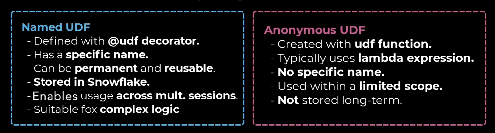

# level up series for snowpark python dev.

[link](https://learn.snowflake.com/en/pages/level-up-snowpark-essentials-track/)

* notebooks setup [link](https://docs.snowflake.com/en/user-guide/ui-snowsight/notebooks-setup)
* notebooks getting started [link](https://docs.snowflake.com/en/user-guide/ui-snowsight/notebooks-get-started)
* working with dataframes [link](https://docs.snowflake.com/en/developer-guide/snowpark/python/working-with-dataframes)
* snowpark code worksheets [link](https://docs.snowflake.com/en/developer-guide/snowpark/python/python-worksheets)
* snowppark procedure from worksheet [link](https://docs.snowflake.com/en/developer-guide/stored-procedure/python/procedure-python-create-worksheet)
* about snowflake python udf 
* user defined table functions udtf [link](https://docs.snowflake.com/en/developer-guide/snowpark/python/creating-udtfs)
* udafs ...aggregated functions [link](https://docs.snowflake.com/en/developer-guide/snowpark/python/creating-udafs)
* vectorize udfs [link](https://docs.snowflake.com/en/developer-guide/snowpark/python/creating-udfs#using-vectorized-udfs)
* reading files with udf [link](https://docs.snowflake.com/en/developer-guide/snowpark/python/creating-udfs#reading-files-with-a-udf)
* dependency management [link](https://docs.snowflake.com/en/developer-guide/python-connector/python-connector-dependencies)
